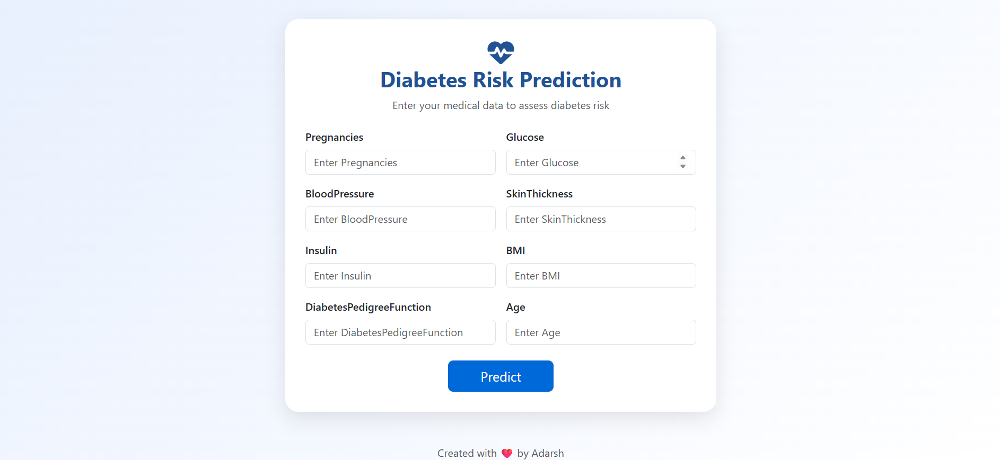

# 🩺 Diabetes Prediction Web App

A modern and responsive web application that predicts whether a person is likely to have diabetes based on medical inputs. Built using **Flask**, **Logistic Regression**, and styled with **Bootstrap 5**.




---

## 🚀 Features

- 🔍 Predicts diabetes using user-provided health metrics
- 🧠 Machine learning model (Logistic Regression)
- 🌐 Modern medical UI with responsive Bootstrap layout
- 💬 Popup-based result display (Diabetes / No Diabetes)
- 📦 Trained model saved with `joblib`
- ⚙️ Scaled input data for accurate predictions
- 🧪 Accuracy ~78% (train) and ~76% (test)
- ❤️ Footer with attribution

---

## 📁 Project Structure

```
diabetes-predictor/
│
├── static/
│   └── css/
│       └── style.css       # Custom styling (optional)
│
├── templates/
│   └── index.html          # Frontend HTML form
│
├── diabetes_model.joblib   # Trained ML model
├── scaler.joblib           # StandardScaler for input normalization
├── app.py                  # Flask backend
├── diabetes.csv            # Dataset
├── requirements.txt        # Python dependencies
└── README.md               # You are here
```

---

## 📊 Dataset Info

- Source: [Pima Indians Diabetes Dataset](https://www.kaggle.com/datasets/uciml/pima-indians-diabetes-database)
- Columns:
  - Pregnancies
  - Glucose
  - BloodPressure
  - SkinThickness
  - Insulin
  - BMI
  - DiabetesPedigreeFunction
  - Age
  - Outcome (0 = No Diabetes, 1 = Diabetes)

---

## 🧠 Model Training

```python
# Training the model
from sklearn.linear_model import LogisticRegression
regression = LogisticRegression(class_weight='balanced')
regression.fit(x_train, y_train)

# Accuracy
Train: ~78%
Test:  ~76%

# Save model and scaler
import joblib
joblib.dump(regression, "diabetes_model.joblib")
joblib.dump(scaler, "scaler.joblib")
```

---

## 🖥️ How to Run Locally

### 1️⃣ Clone the Repo
```bash
git clone https://github.com/<your-username>/diabetes-predictor.git
cd diabetes-predictor
```

### 2️⃣ Create a Virtual Environment
```bash
python -m venv venv
source venv/bin/activate    # macOS/Linux
venv\Scripts\activate       # Windows
```

### 3️⃣ Install Dependencies
```bash
pip install -r requirements.txt
```

### 4️⃣ Run the App
```bash
python app.py
```
Then open [http://127.0.0.1:5000](http://127.0.0.1:5000) in your browser.

---

## 🌐 Live Demo

[🔗 Live App on Railway](https://diabetesprediction.up.railway.app/)

---

## 📦 Requirements

```
flask
numpy
pandas
scikit-learn
joblib
```

Or install manually:
```bash
pip install flask numpy pandas scikit-learn joblib
```

---

## 🖌️ Screenshots

| Input Form                     | Prediction Popup                  |
|-------------------------------|------------------------------------|
|      |          |

---

## 🙌 Contributing

Pull requests are welcome. If you’d like to add new models or improve the UI, feel free to fork and submit a PR.

---

## 📄 License

This project is open-source under the [MIT License](LICENSE).

---

## 👨‍⚕️ Created with ❤️ by Adarsh Paswan
